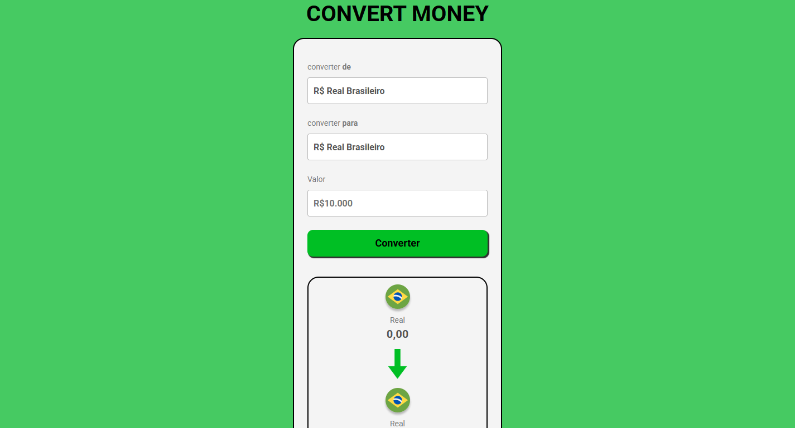

<h1>Projeto conversor de moedas.🚀💰</h1>
 
<h2>Esse projeto foi criado para aprimorar o meu desempenho com Javascript.</h2>
 
Tecnologias ultilizadas:

Veja o meu projeto <a href="https://projeto-conversor-master.vercel.app/">aqui </a>!

